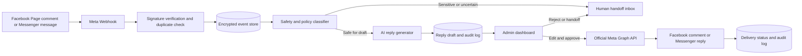

# Mahbub Sardar Sabuj Facebook Assistant

## Official, human-controlled AI reply system: architecture and implementation specification

**Status:** Development design, approval required before production integration.

এই নকশার একমাত্র উদ্দেশ্য হলো মাহবুব সরদার সবুজের Facebook Page-এর comment ও Messenger conversation একটি নিরাপদ dashboard থেকে পরিচালনা করা। সব integration কেবল Meta-এর official Facebook Login, Graph API এবং Webhooks ব্যবহার করবে। কোনো password সংগ্রহ, scraping, headless browser, third-party login automation কিংবা unofficial API ব্যবহার করা হবে না।

> প্রথম release হবে **Draft Mode**। AI কখনো নিজে থেকে Facebook-এ comment বা Messenger reply পাঠাবে না। Admin reply দেখে approve করলে তবেই official Meta API দিয়ে পাঠানো হবে।

## 1. Required user experience

| ব্যবহারকারী | কী করবেন | System কী করবে |
|---|---|---|
| Page administrator | নিজের Facebook account দিয়ে connect করবেন | Meta consent নিয়ে page list আনবে এবং নির্বাচিত Page-এর official access token server-side encrypted রাখবে |
| Commenter | Page post-এ comment করবেন | Webhook comment event গ্রহণ করবে, post ও comment context সংরক্ষণ করবে, safety screen চালিয়ে draft তৈরি করবে |
| Messenger user | Page-এ message পাঠাবেন | Webhook message গ্রহণ করবে, conversation context ও knowledge base দিয়ে draft তৈরি করবে |
| Admin | Dashboard-এ approve, edit, reject বা handoff করবেন | শুধু approved reply official Graph API-তে পাঠাবে এবং immutable audit log রাখবে |
| Admin | Automation settings পরিবর্তন করবেন | Comment, Messenger এবং future auto-send আলাদাভাবে ON/OFF করতে পারবেন |

## 2. Two compliant implementation routes

| Approach | কী পাওয়া যাবে | Trade-off | Cost | Setup complexity |
|---|---|---|---|---|
| **Draft-first dashboard** | Comment ও Messenger event dashboard-এ আসে; admin-এর click-এ AI draft তৈরি ও পাঠানো হয় | সবচেয়ে নিরাপদ ও সহজ; real-time automatic draft generation নয় | বর্তমান website infrastructure-এর বাইরে আলাদা always-on service প্রয়োজন নেই | কম |
| **Real-time draft queue** | Event আসার সঙ্গে সঙ্গে server draft তৈরি করে admin inbox-এ দেখায়; send এখনও manual approval-এ থাকবে | Fast response-এর জন্য durable queue ও background processor প্রয়োজন | Hosting ও AI usage অনুযায়ী চলমান খরচ হতে পারে | মাঝারি |
| **Future auto-reply mode** | Confidence ও safety rules পাস করলে approved policy অনুযায়ী reply automatically যায় | App Review, testing, policy monitoring এবং human handoff বাধ্যতামূলক | আগের সব খরচের সঙ্গে monitoring cost | বেশি |

প্রথম release-এর জন্য **Draft-first dashboard** নিরাপদ ভিত্তি। এর ওপর পরীক্ষিত reply quality, Meta approval এবং clear user disclosure নিশ্চিত হওয়ার পর real-time draft queue যুক্ত করা যাবে। Auto Reply আলাদা, পরবর্তী পর্যায়ের feature; এটি default-এ বন্ধ থাকবে।

## 3. Recommended system flow

Webhook callback signature যাচাই করার পরে event প্রথমে database-এ লেখা হবে এবং একই event পুনরায় এলে unique event key ব্যবহার করে বাদ দেওয়া হবে। Meta webhook দ্রুত acknowledgement চায়, তাই event processing এবং AI generation আলাদা staged job হিসেবে নকশা করা হবে। Messenger event, reply, human handoff এবং send failure প্রতিটির audit trail থাকবে। Meta signed payload verification, retry handling এবং timestamp order বজায় রাখার কথা official documentation-এ বলা হয়েছে। [1]

## 4. Dashboard structure

Admin area existing authenticated dashboard-এর ভেতরে থাকবে। Home page ও public design অপরিবর্তিত থাকবে। নতুন tool route admin-only হবে, public navigation-এ প্রকাশ করা হবে না।

| Dashboard area | মূল কাজ |
|---|---|
| **Overview** | pending drafts, human handoff, send failures, Page connection state, last webhook time |
| **Inbox** | Messenger conversation, context timeline, draft, manual reply, handoff state |
| **Comments** | Page post context, incoming comment, suggested reply, approve/edit/reject |
| **Knowledge Base** | business information, services, price, FAQ, delivery, contact, policy এবং approved answers |
| **Writing Style** | sample reply, tone instructions, allowed language, short/long reply preference |
| **Rules & Safety** | blocked keywords, sensitive topics, spam handling, mandatory handoff conditions |
| **History & Audit** | received event, AI draft, admin edit, approval, sent reply, Meta result/error |
| **Settings** | Page connect/disconnect, Comment Draft ON/OFF, Messenger Draft ON/OFF, Auto Reply future setting, disclosure text, data retention |

## 5. AI reply workflow

AI model শুধু server-side থেকে call হবে। Browser, Facebook client বা public API response-এ AI credential কখনো থাকবে না। Reply generator-এ নিচের input যাবে:

1. সংশ্লিষ্ট Page post-এর text ও lightweight metadata।
2. user-এর comment বা Messenger message।
3. সর্বশেষ conversation messages, limited window এবং timestamp order।
4. active knowledge base entries এবং communication style profile।
5. active safety rules, blocked topic rules ও handoff policy।

AI output structured data হিসেবে নিতে হবে যাতে free-form text-এর পাশাপাশি `replyText`, `needsHuman`, `reason`, `confidence`, `knowledgeReferences`, `safetyFlags` এবং `suggestedCategory` থাকে। Unknown business facts তৈরি করা নিষিদ্ধ থাকবে। Price, payment, refund, dispute, personal data, legal, medical, harassment, threat, account recovery অথবা human request থাকলে draft auto-send eligible হবে না।

### Mandatory human handoff triggers

| Trigger | System action |
|---|---|
| Knowledge base-এ উত্তর নেই বা confidence কম | Human handoff queue |
| Refund, payment, dispute, legal, medical বা privacy matter | Human handoff queue |
| Threat, abuse, self-harm, scam বা personal-data risk | No AI reply; high-priority admin alert |
| User একজন মানুষের সঙ্গে কথা বলতে চান | Conversation handoff; AI paused |
| 24-hour Messenger window closed | Automated send blocked |
| Repeated send failure or invalid Page token | Sending paused; admin settings alert |

## 6. Proposed secure data model

| Table | Purpose | Critical controls |
|---|---|---|
| `facebook_page_connections` | selected Page, connection state, approved scopes and encrypted token reference | token encrypted, no token sent to browser, Page ID unique |
| `facebook_webhook_events` | raw verified event and delivery state | provider event ID unique, payload minimised, retention policy |
| `facebook_posts` | minimum post context needed for comment replies | Page ownership check |
| `facebook_conversations` | Messenger PSID, state, last-user-message time and 24-hour expiry | PSID never publicly exposed |
| `facebook_messages` | incoming, draft, admin and sent message timeline | provider message ID unique; content access admin-only |
| `facebook_reply_drafts` | AI proposal, safety result, admin edits and approval state | default `pending`; send requires explicit admin actor |
| `facebook_knowledge_entries` | FAQ, service, price, policy and approved facts | version history and active flag |
| `facebook_style_profiles` | writing samples and tone configuration | admin-only edit |
| `facebook_safety_rules` | keyword and category controls | policy action and audit trail |
| `facebook_audit_log` | connection, event, draft, approval, send and failure history | append-only application behaviour |

The existing MySQL/Drizzle schema, user roles and admin dashboard foundations can support these tables. Integration data will remain separate from the public literary site content.

## 7. Meta scopes and review plan

Only minimum scopes will be requested. Exact permission availability will be verified again against the Meta App Dashboard at configuration time.

| Use case | Expected official permission or requirement |
|---|---|
| show Pages available to Page admin | `pages_show_list` |
| receive Page feed webhook | `pages_manage_metadata` plus `pages_show_list` |
| read Page engagement and comments | `pages_read_engagement`, `pages_read_user_engagement` |
| post Page comment replies | `pages_manage_engagement` and Page tasks `MODERATE` / `CREATE_CONTENT` |
| receive and respond to Messenger messages | `pages_messaging`, appropriate Page messaging task, Page webhook subscription |
| customer use outside developer/tester roles | Meta App Review and Advanced Access |
| broader production use | Business Verification and data-handling review as required by Meta |

Meta documents that Page feed webhooks require `pages_manage_metadata` and `pages_show_list`, message webhooks additionally require `pages_messaging`, and Page comment actions use `pages_manage_engagement`, `pages_read_engagement`, and `pages_read_user_engagement`. [1] [2] Meta also requires a public HTTPS callback, verifies it using a challenge, recommends SHA-256 request signature validation, and requires prompt event acknowledgement. [1]

## 8. Messenger policy controls

The system will never send a Messenger message before a user initiates the conversation. Standard responses are limited to the official 24-hour messaging window. Outside that window, automated responses will be blocked; this tool will not misuse message tags or attempt to bypass messaging policy. [3] [4]

The first automated or resumed automated interaction will use a configurable disclosure when applicable law requires it. This is a policy and legal compliance measure, not a decorative label. Meta documents both the automated-experience disclosure requirement and the 24-hour response window. [3] [4]

The human handoff dashboard state will pause AI suggestions for that conversation until an admin resumes it. The advanced Meta Handover Protocol will only be used if a compatible second inbox application is later connected; it is not required for the first release. [5]

## 9. Security and privacy controls

| Control | Requirement |
|---|---|
| Webhook authenticity | verify `X-Hub-Signature-256` using constant-time comparison before accepting event |
| Callback verification | validate Meta verify token and return challenge only on exact match |
| Token protection | encrypted at rest; environment keys stored only in server deployment settings |
| Access control | existing admin role only; no public access to inbox, raw events, PSID or tokens |
| Replay safety | deduplicate provider event and message IDs; idempotent send job |
| Rate and abuse control | throttle dashboard operations; reject oversized payloads; use provider retries safely |
| Prompt security | untrusted Facebook text is data, never instruction; safety rules remain authoritative |
| Data minimisation | store only fields necessary for moderation and support; configurable retention/deletion |
| Auditability | record every connection, draft, modification, approval, send and error with time/actor |
| Error behavior | no secrets in UI or logs; failed sends stay pending for admin review |

## 10. Staged delivery plan

| Phase | Deliverable | Auto-send status |
|---|---|---|
| 1. Foundation | Admin-only dashboard shell, database tables, knowledge base, style profile, safety rules and audit log | Off |
| 2. Draft workflow | Manual sample input and AI-generated draft; approve/edit/reject UX | Off |
| 3. Official Meta readiness | Meta OAuth callback, Page selection, encrypted token storage and webhook verification endpoint | Off |
| 4. Live draft intake | Verified Page comments and Messenger messages appear in the dashboard; AI generates drafts | Off |
| 5. Controlled send | Admin-approved Page comment and Messenger replies are sent with the official Graph API | Off by default |
| 6. Optional automation | Narrow, tested rule sets with confidence thresholds, policy checks and instant human handoff | Explicit admin opt-in only |

## 11. Required administrator actions before live Meta connection

1. Create or select a Meta developer app owned by the Page/business.
2. Complete Meta Business Verification and App Review for the permissions needed beyond app roles.
3. Provide the Meta App ID, App Secret and webhook verification token through server deployment secrets, never in chat or source code.
4. Log in as a Page administrator and explicitly approve the requested permissions.
5. Configure Meta App Dashboard callback URL after the secure webhook endpoint is live.
6. Provide business knowledge base, approved reply samples, restricted topics and the required public privacy-policy/data-deletion URL if requested by Meta.
7. Test on a Page where the Page admin is a Meta app role holder before requesting broader live access.

## References

[1]: https://developers.facebook.com/docs/graph-api/webhooks/getting-started/webhooks-for-pages/ "Meta: Webhooks for Pages"
[2]: https://developers.facebook.com/documentation/pages-api/comments-mentions "Meta: Pages API Comments and @mentions"
[3]: https://developers.facebook.com/documentation/business-messaging/messenger-platform/policy "Meta: Messenger Platform and IG Messaging API policy"
[4]: https://developers.facebook.com/documentation/business-messaging/messenger-platform/send-messages "Meta: Send a Message"
[5]: https://developers.facebook.com/documentation/business-messaging/messenger-platform/webhooks/webhook-events/messaging_handovers "Meta: messaging_handovers Webhook Event Reference"
